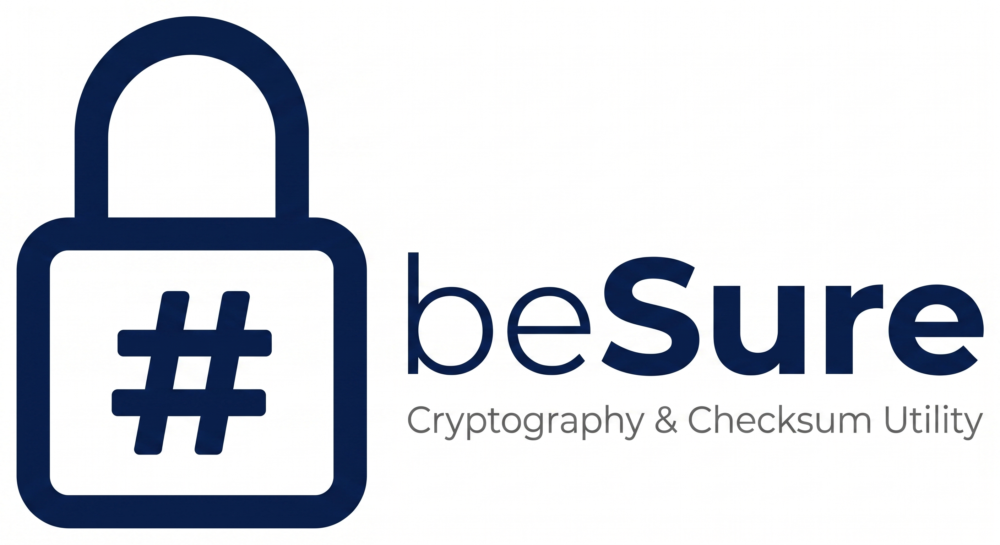
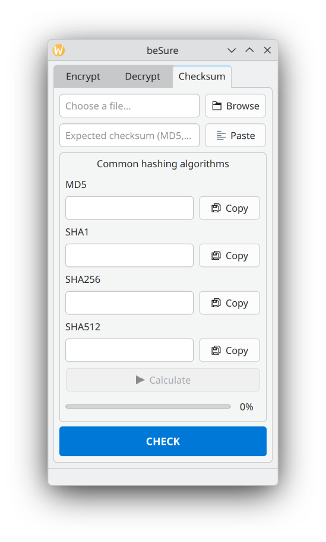

# beSure - Cryptography & Checksum Utility
         

This mini-program was developed as a final project for the **NT101** course at **VNUHCM - UIT**. 

Its primary purpose is to demonstrate the practical application of two distinct encryption algorithms: **Playfair** (Classical Cryptography) and **RSA** (Modern Cryptography). Other than that, it also has a useful feature: File **Checksum Checker**.

## 🚀 Features

### 1. Encryption Algorithms
*   **Playfair Cipher:** Full support for Encryption and Decryption.
*   **RSA Algorithm:** Supports Encryption, Decryption, Digital Signature creation (using built-in SHA256 hashing), and Signature Verification.

### 2. File Checksum Checker
A highly useful built-in feature to verify file integrity.
*   **Supported Hashes:** MD5, SHA1, SHA256, and SHA512.
*   **Verification:** Easily compare an expected checksum with the one calculated by the program to determine if your file has been tampered with or modified.

## Downloads
Download a portable version for Windows by [visiting release page](https://github.com/phaamlong102/beSure/releases).

## 👨‍💻 Authors
*   **Pham Duc Long:** UI/UX Design & Checksum Feature Implementation.
*   **Ngo Nhat Linh:** Core Logic for Playfair & RSA Algorithms.

         

